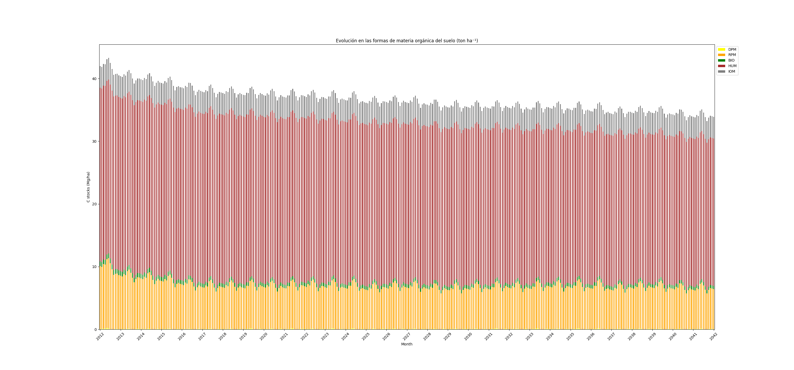
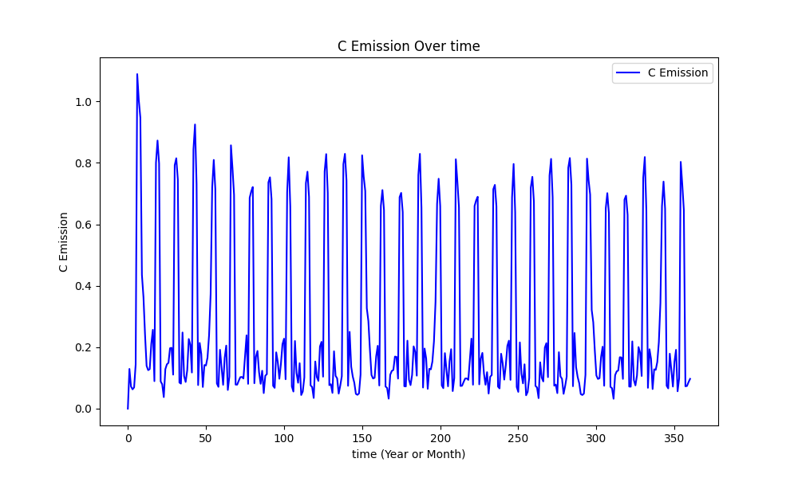

# Easy_Roth_Carbon

Python version of The Rothamsted carbon model (RothC) 26.3.  
RothC is a model for the turnover of organic carbon in non-waterlogged topsoil that accounts for the effects of soil type, temperature, soil moisture, and plant cover on the turnover process.

---

## 1. Input Excel File

Place your Excel file in the `input_data` folder. The input file should contain the following columns:

- **Year**: Year of the data
- **Month**: Month of the data
- **Temp**: Monthly average temperature (°C)
- **Rain**: Monthly rainfall (mm)
- **ETP**: Monthly evapotranspiration (mm)
- **Cinp**: Carbon input monthly (tC/ha)
- **FYM**: Carbon from farmyard manure (tC/ha)
- **PC**: Plant cover (1 if present, 0 otherwise)
- **DPM_RPM**: Ratio of decomposable to resistant plant material (dpm/rpm) (see Coleman)
- **Clay**: Percentage of clay in the soil (0 to 100)
- **Depth**: Soil depth (cm)
- **SOC**: Soil Organic Carbon at the start of the simulation (tC/ha over the first `Depth` cm)

---

## 2. Configuration File

In the configuration file (`config.json`), set the following parameters:

- **nbr_year**: Number of years to simulate (default: 30)
- **init_mode**: Initialization mode (`spin`, `set`, or `Weihermuller`)
  - **Weihermuller mode** (see Weihermuller et al., 2013):
    - `self.rpm = (0.1847 * self.soc + 0.1555) * (self.clay + 1.2750)**(-0.1158)`
    - `self.hum = (0.7148 * self.soc + 0.5069) * (self.clay + 0.3421)**0.0184`
    - `self.bio = (0.0140 * self.soc + 0.0075) * (self.clay + 8.8473)**0.0567`
    - `self.iom = 0.049 * self.soc**1.139`
    - `self.dpm = self.soc - (self.rpm + self.hum + self.bio + self.iom)`
  - **Spin mode**: Finds equilibrium in soil dynamics by iterating over carbon inputs.
  - **Set mode**: Allows manual initialization of carbon pools (`init_set_soc`): `[dpm, rpm, hum, bio, iom]`

- **swc**: Soil water content in January (default: 0)
- **SHOW**: Set to 1 to display graphics, 0 otherwise

### Hyper-parameters

- **rmf_min**: Minimum root mass fraction (default: 0.2)
- **decomp_params**: Decomposition parameters (default: `[10, 0.3, 0.66, 0.02]`)
- **decomp_ratio**: Decomposition ratio (default: `[0.46, 0.54]`)
- **fym_ratio**: Farmyard manure ratio (default: `[0.49, 0.49, 0.02]`)

---

## 3. Running the Model

Run the `main.py` script to execute the simulation.

## 4. Example

